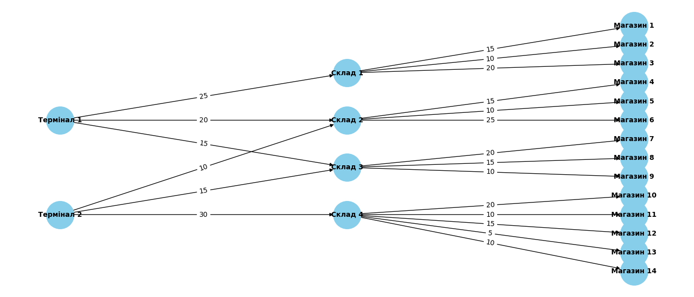

## Візуалізація логістичної мережі

## Потоки між терміналами і магазинами:

| Термінал | Магазин | Потік (одиниць) |
|----------|---------|------------------|
| Термінал 1 | Магазин 1 | 15 |
| Термінал 1 | Магазин 2 | 10 |
| Термінал 1 | Магазин 3 | 20 |
| Термінал 1 | Магазин 4 | 15 |
| Термінал 1 | Магазин 5 | 10 |
| Термінал 1 | Магазин 6 | 20 |
| Термінал 1 | Магазин 7 | 15 |
| Термінал 1 | Магазин 8 | 15 |
| Термінал 1 | Магазин 9 | 10 |
| Термінал 1 | Магазин 10 | 0 |
| Термінал 1 | Магазин 11 | 0 |
| Термінал 1 | Магазин 12 | 0 |
| Термінал 1 | Магазин 13 | 0 |
| Термінал 1 | Магазин 14 | 0 |
| Термінал 2 | Магазин 1 | 0 |
| Термінал 2 | Магазин 2 | 0 |
| Термінал 2 | Магазин 3 | 0 |
| Термінал 2 | Магазин 4 | 10 |
| Термінал 2 | Магазин 5 | 10 |
| Термінал 2 | Магазин 6 | 10 |
| Термінал 2 | Магазин 7 | 15 |
| Термінал 2 | Магазин 8 | 15 |
| Термінал 2 | Магазин 9 | 10 |
| Термінал 2 | Магазин 10 | 20 |
| Термінал 2 | Магазин 11 | 10 |
| Термінал 2 | Магазин 12 | 15 |
| Термінал 2 | Магазин 13 | 5 |
| Термінал 2 | Магазин 14 | 10 |

## Зведена таблиця: Максимальний потік до кожного магазину

| Магазин | MAX of Потік |
|---------|---------------|
| Магазин 10 | 20 |
| Магазин 3 | 20 |
| Магазин 6 | 20 |
| Магазин 1 | 15 |
| Магазин 12 | 15 |
| Магазин 4 | 15 |
| Магазин 7 | 15 |
| Магазин 8 | 15 |
| Магазин 11 | 10 |
| Магазин 14 | 10 |
| Магазин 2 | 10 |
| Магазин 5 | 10 |
| Магазин 9 | 10 |
| Магазин 13 | 5 |

## Пояснення розрахунку:
Максимальний потік визначаєтсья мінімальною пропускною здатністю каналів, які є частинами маршруту. Тож, наприклад, максимальний потік до магазину 13 складає всього 5 одиниць через те, що канал від Складу до Магазину має таку пропускну здатність, навіть попри високу пропускну здатність від Термінала до Складу. 

## Відповіді на питання:
1. Які термінали забезпечують найбільший потік товарів до магазинів?
 - Термінал 1, бо його найменша пропускна здатність більша за найменшу пропускну здатність терміналу 2 та сумарний потік більший за потік терміналу 2.

2. Які маршрути мають найменшу пропускну здатність і як це впливає на загальний потік?
 - Найменшу пропускну здатність має маршрут Термінал 2 > Склад 4 > Магазин 13 (пропускна здатність = 5). Наявність маршруту Склад 4 > Магазин 13 не є доцільним без збільшення його пропускної здатності, оскільки цей потік суттєво зменшує початкову пропускну здатність каналу.

3. Які магазини отримали найменше товарів і чи можна збільшити їх постачання, збільшивши пропускну здатність певних маршрутів?
 - Найменше товарів отримано у Магазині 13 (5 одиниць). Далі низькі показники мають Магазини 2, 5, 9, 11, 14. Для оптимального використання пропускної здатності каналу Термінал 2 > Склад 4, було б доцільно у 6 разів збільшити пропуснкут здатність каналу Склад 4 > Магазин 13. Щодо інших магазинів, поставка до яких також лежить через Термінал 2 > Склад 4, а саме мова про Магазин 11 та 14, то збільшення пропускної здатності там у 3 рази привело б до найбільш оптимального рішення задачі постачання. Щодо магазину 9, то незалежно від Терміналу постачання, пропускну здатність від Складу 3 до нього було б доцільно збільшити на 5. Якщо говорити про Магазин 5, то для нього можна не збільшувати пропускну здатність каналу від Складу до Магазину, а просто використовувати Термінал 2 як оптимальний шлях, який не зменшує пропускну здатність початкового каналу (від Терміналу до Складу).

4. Чи є вузькі місця, які можна усунути для покращення ефективності логістичної мережі?
 - Найбільшим вузьким місцем є факт недовикористання пропускної здатності канала Термінал 2 > Склад 4 (пропускна здатність 30). З нього визодить аж 5 потоків, але усі йдуть на зменшення, і дельта з початковим потоком тут найбільша, тож збільшення пропускної здатності маршрутів до магазинів 13 (дельта 25), 11 (дельта 20) та 14 (дельта 20) є критично важливими для ефективної роботи мережі. 
